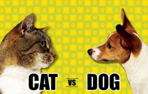

# Cats-and-Dogs-Classification

Cats and Dogs Classification using Convnet
# Download Cats and Dogs Datasets from kaggle or github 
This datasets are containt 60000 images.
# following link contain sorted datasets thats i created.
https://drive.google.com/open?id=16kBQ1Tr0HMQvAZ_Xr-PbJ4H8QxJUydBa
#Datasets contain three folder
1) train (1000 for cats and 1000 for dogs)
2) test (next 500 for cats and 500 for dogs)
3) validatiaon ( next 500 for cats and 500 for dogs)
# which IDE used
Here is i used Google Colabs and store datasets on Google Drive , you can also use your local drive. 
if you switch any notebook ,just datasets path will be change.
# Import important packeges or library
packages like os , shutil,keras, matplotlib
# create model 
using Conv2D , Maxpooling,Dropout,Flatten etc.
# How to compile model 
 compile method have three attribute 
 1)loss
 2)optimizer 
 3) metrics
 
 #Lets train the convnet using data - augmentation generators
 
 
 # Save model using save('your project name.h5')
 
 
## using matplotlib use can see the graphical representation

